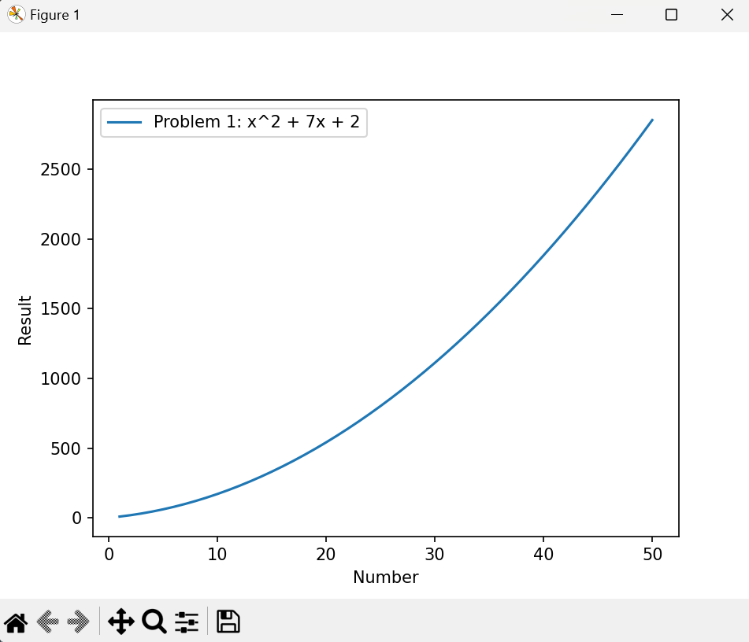
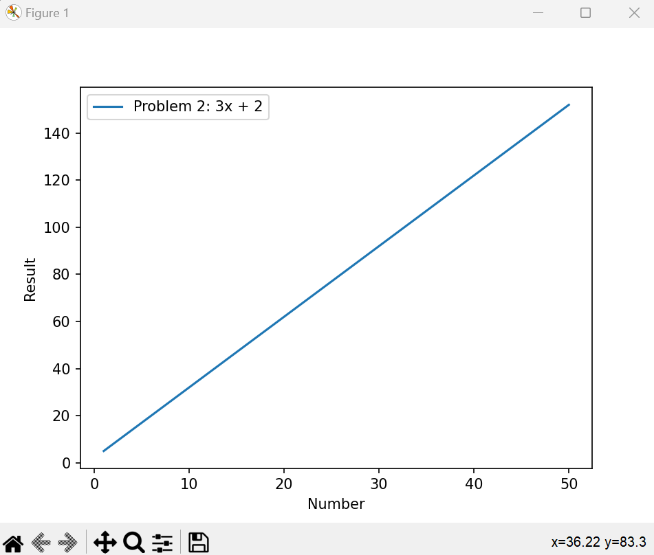
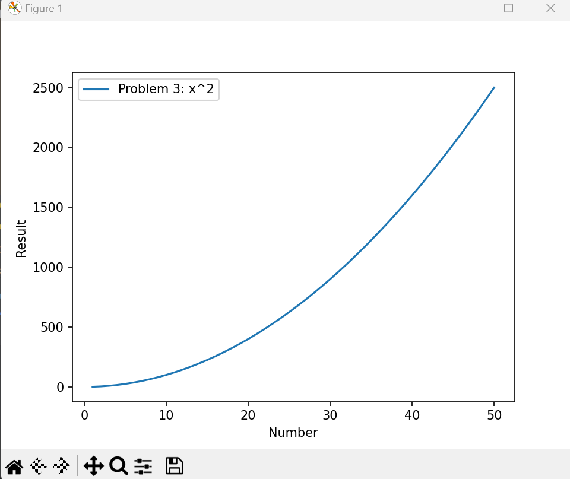
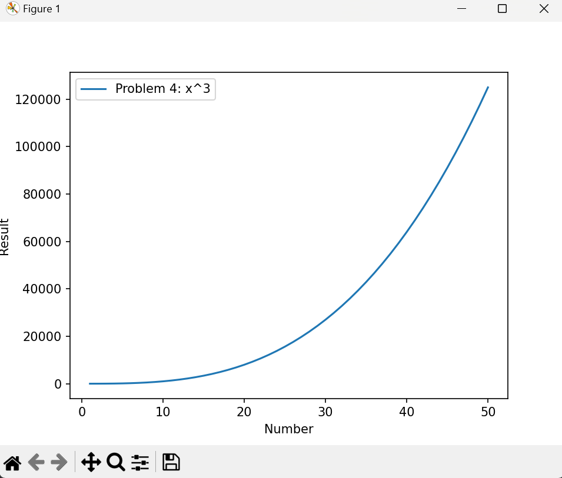
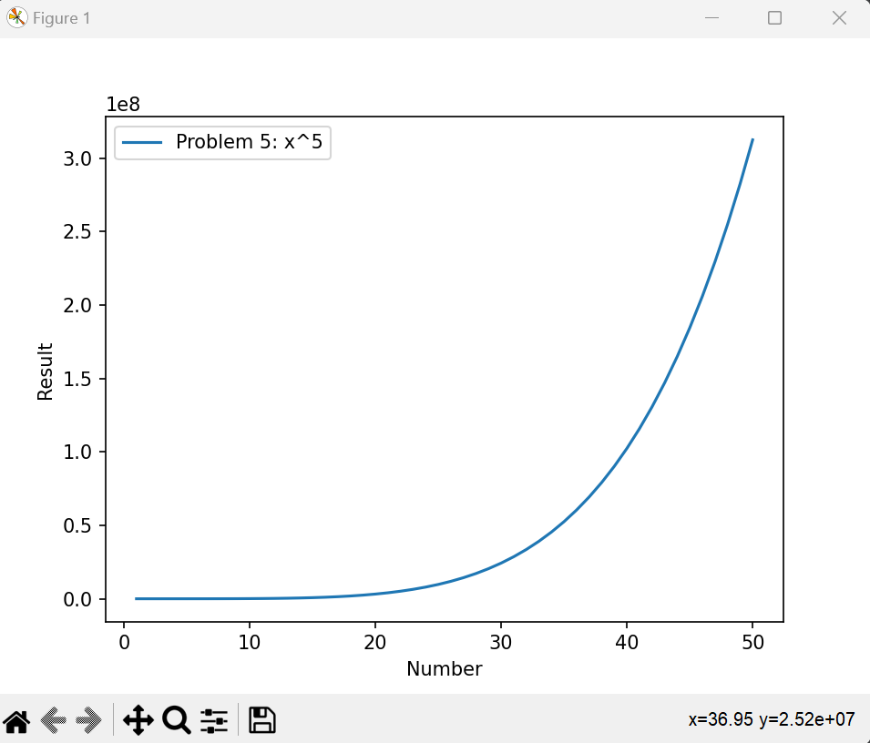
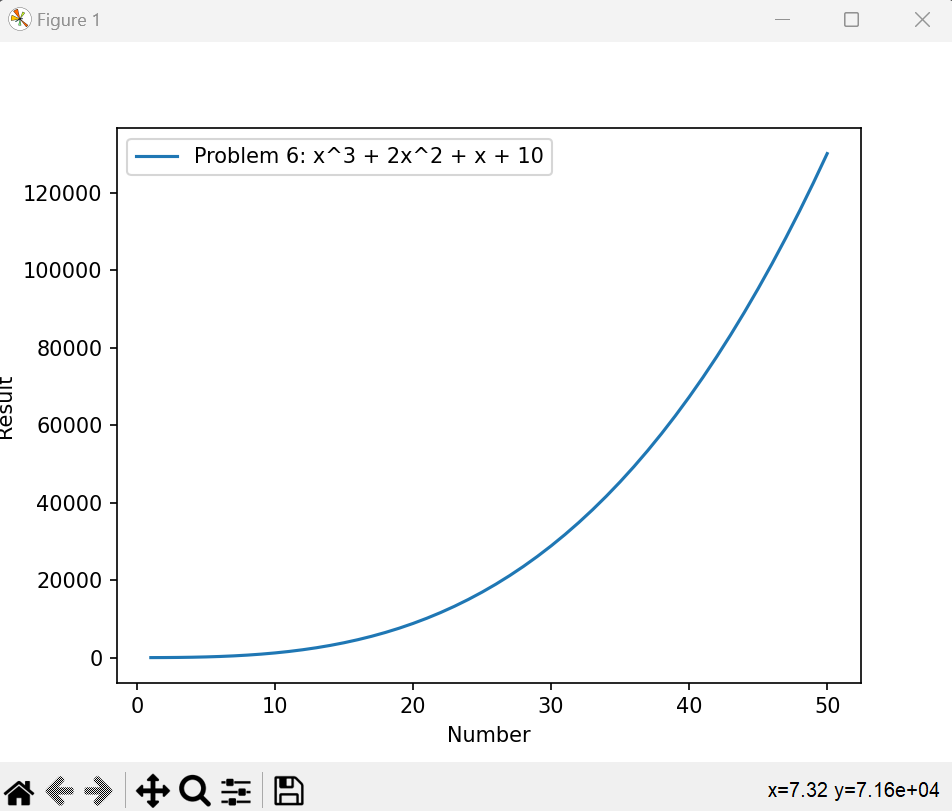
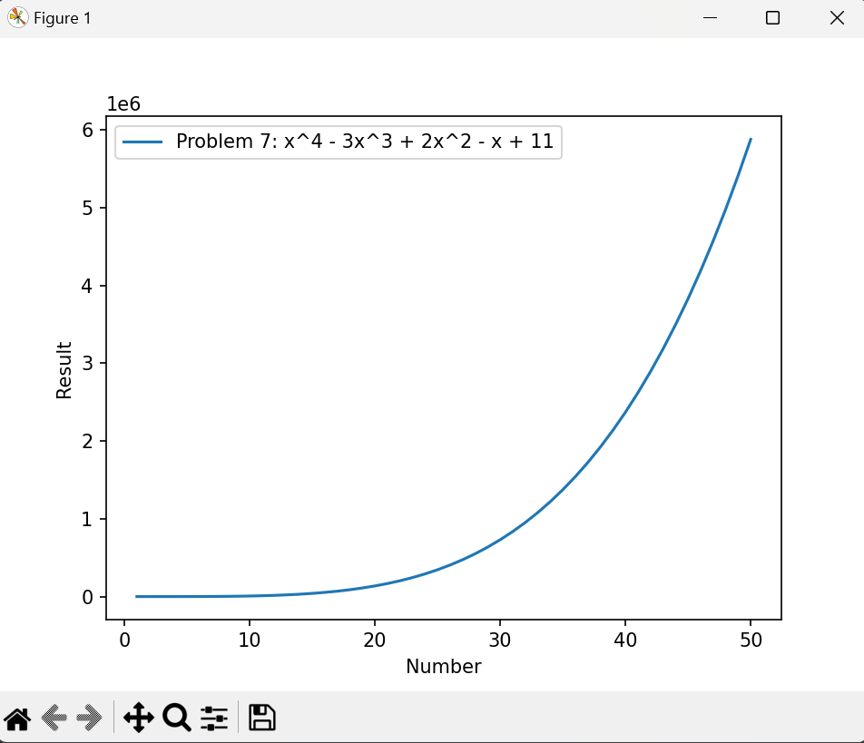
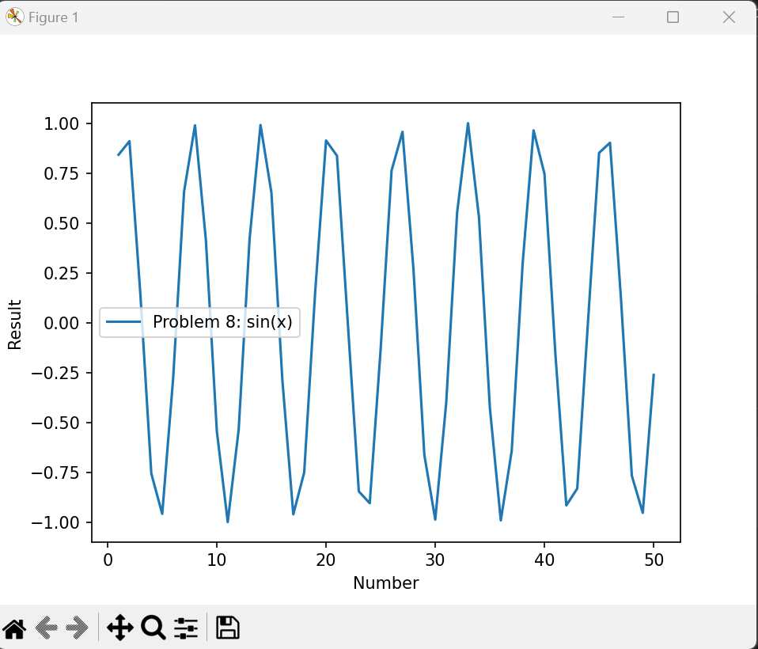
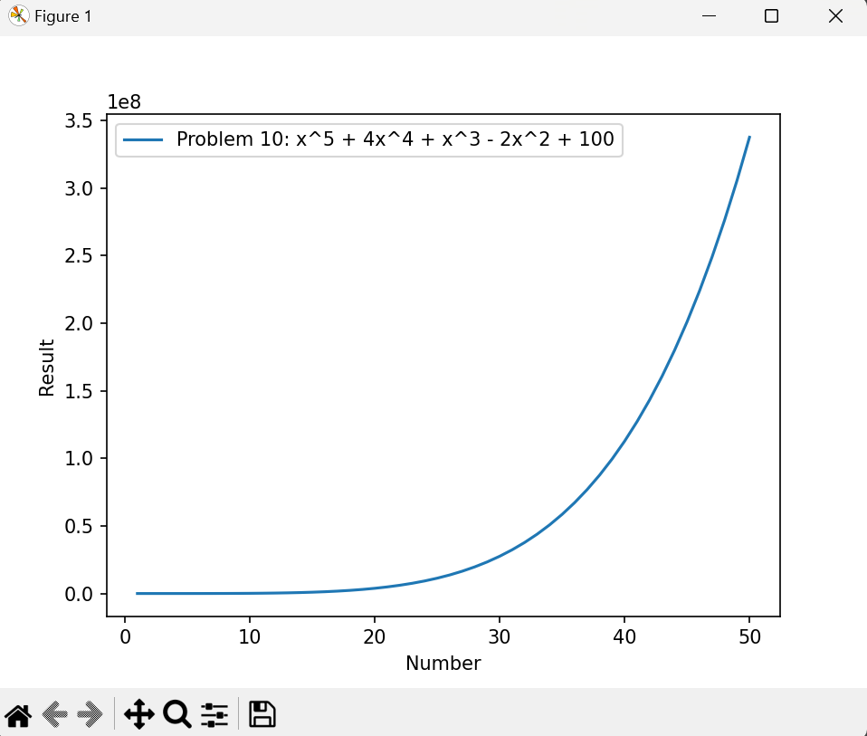
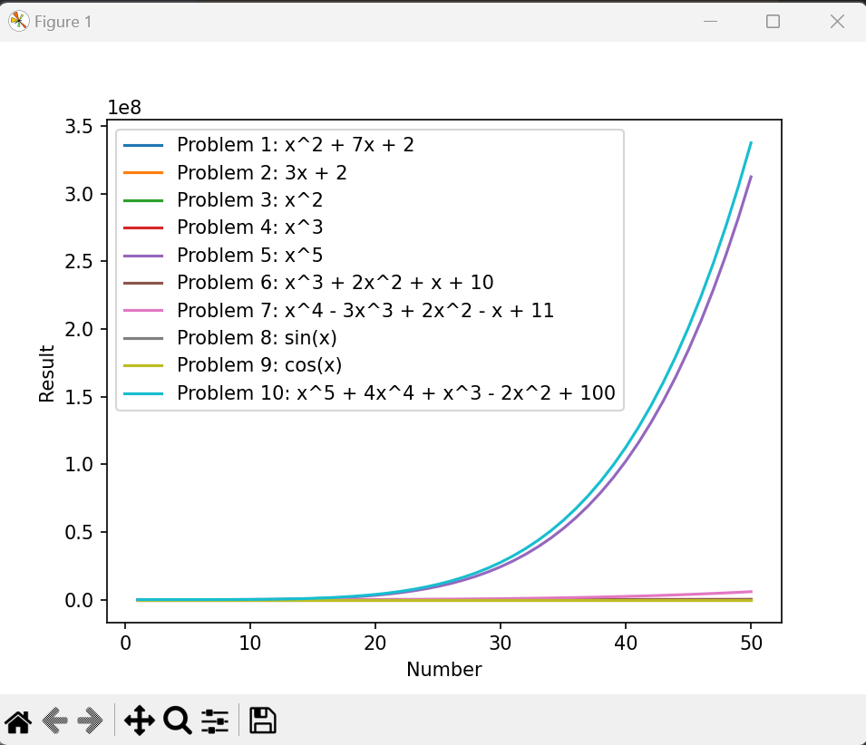

# Data-Structures-and-Algorithms
This Python project is a mathematical function solver and plotter. It allows the user to select from a list of predefined mathematical functions, solves these functions for a range of values, and then plots the results. 
# Functionality
---
> The project is primarily composed of several functions, each with a specific role:

— prob1() to prob10(): These functions represent the 10 predefined mathematical functions that the user can choose from. Each function takes a range of values (stored in valueX), applies the mathematical operation, and returns the results as a list. 

— createFile(numberEquation): This function writes the results of the chosen mathematical function to a file. If the user chooses to solve all functions (option 11), it writes the results of all functions to the file.

— readfile(): This function reads the results from the file written by createFile(). It converts each line of the file back into a list of results using ast.literal_eval().  

— plot_results(): This function plots the results read by readfile(). If the user chose to solve all functions, it plots each function separately. The label for each plot includes the problem number and the corresponding function expression.

# Usage
The user is prompted to choose a mathematical function to solve from a list of options. The options are: 
---
>f(x) = x^2 + 7x + 2

>f(x) = 3x + 2

>f(x) = x^2

>f(x) = x^3

>f(x) = x^5

>f(x) = x^3 + 2x^2 + x + 10

>f(x) = x^4 - 3x^3 + 2x^2 - x + 11

>f(x) = sin(x)

>f(x) = cos(x)

>f(x) = x^5 + 4x^4 + x^3 - 2x^2 + 100

>All Functions from 1-10

After the user makes a selection, the program solves the chosen function(s) for a range of values, writes the results to a file, reads the results from the file, and then plots the results.

# Requirements
This project requires Python 3 and the following Python libraries installed:  
---
>— NumPy

>— Matplotlib

>— ast

>— math

# Files
---
>main.py: This is the main Python script to run.

>numbers.txt: This file contains the range of values for which the mathematical functions are solved.

>result.txt: This file is used to store the results of the mathematical functions.

# Screen Shots

<picture> 
  
</picture>
<picture>
  
</picture>
<picture> 
  
</picture>
<picture>
  
</picture>
<picture> 
  
</picture>
<picture>
  
</picture>
<picture> 
  
</picture>
<picture>
  
</picture>
<picture> 
  
</picture>
<picture>
  
</picture>
<picture> 
  
</picture>

